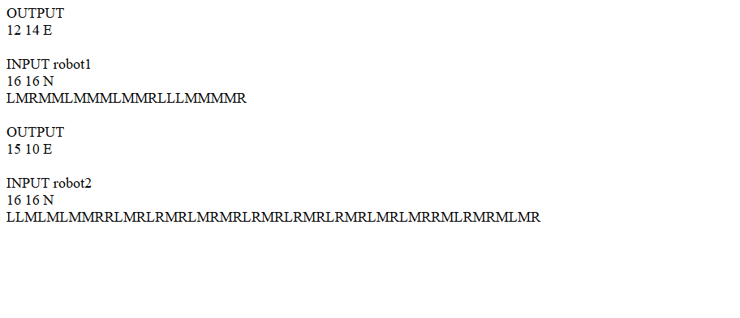

# robotsquad
robots are exploring the space

A small project in php that implements two classes . The Map class that is the main map and the Robot class that you can create objects . You give them direction and starting position and in the end the output of new position and direction is printed

